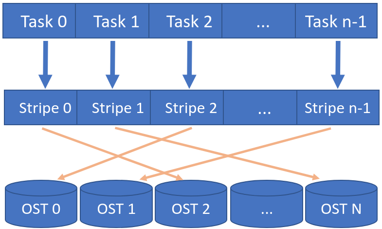

# Lustre experiments

*Still under construction*

Code to test parallel read/write patterns on Lustre filesystems.

The repository cotains C++ and shell scripts to test parallel I/O patterns on Lustre filesystems.
Most of the code is independent of the actual filesystem type but
does have a dependency on SLURM evnvironment variables.

## Worflow

All the tests normally implement the following workflow:

1. Generate striped file with N stripes (e.g. one stripe per OST).
   E.g. `lfs setstripe -c $num_stripes -S $stripe_size $fname -i 0`
2. Allocate SLURM resources, setting the number of processes equal to
   the number of stripes.
   E.g. `salloc -N 4 -n 111 -p debugq --cpus-per-task 1`
3. Launch application which reads/writes one stripe per process
    `./srun_par_write.sh tmp-data/xxx $TEST_FILE_SIZE`

## Mapping tasks to OSTs

Each process reads/write a single stripe which resides on a specific OST.



Running:
   `lfs getstripe tmp-data/xxx`

Displays the list of OSTs where the stripes are stored:

```
tmp-data/xxx
lmm_stripe_count:  111
lmm_stripe_size:   10485760
lmm_pattern:       1
lmm_layout_gen:    0
lmm_stripe_offset: 0
        obdidx           objid           objid           group
             0       390974442     0x174dcbea                0
            48       392174723     0x17601c83                0
            56       392059765     0x175e5b75                0
            32       391554514     0x1756a5d2                0
            96       385614206     0x16fc017e                0
           104       385511226     0x16fa6f3a                0
            80       385144861     0x16f4d81d                0
            88       385622274     0x16fc2102                0
            72       385986728     0x1701b0a8                0
            36       391113123     0x174fe9a3                0
            28       385758496     0x16fe3520                0
...
```
The list *should* show the stripe location from stripe zero to
(number of stripes - 1) sequentially, it should therefore map
the row to the stripe and task id.

## Code

`/src` C++:

* `simple_read_test.cpp`: parallel read, options to compile with buffered or unbuffered I/O and aligned memory buffers.
   To be run from within SLURM, no dependencies.
* `simple_write_test.cpp`: parallel write, options to compile with buffered or unbuffered I/O and aligned memory buffers.
   To be run from within SLURM, no dependencies.
* `read_test.cpp`: parallel read with many configuration options, depends on `lustreapi`.

`/osts_tests` Shell:

Intended to test per-OST performance.

* `slurm_par_read.sh`: parallel read using `dd`, SLURM env vars are used to determine the file pointer offset and the chunk size.
* `slurm_par_write.sh`: parallel write using `dd`, SLURM env vars are used to determine the file pointer offset and the chunk size.

